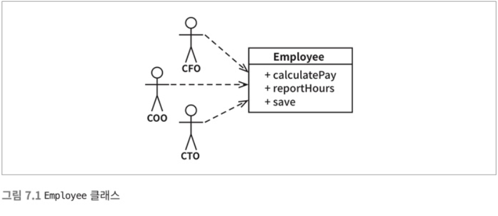
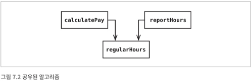
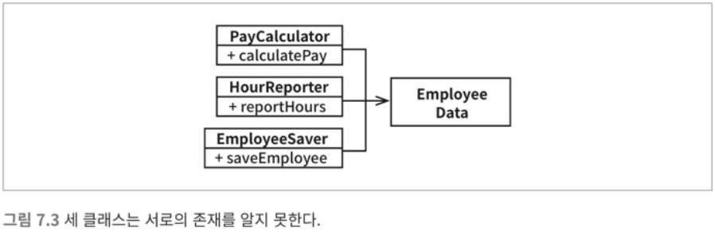
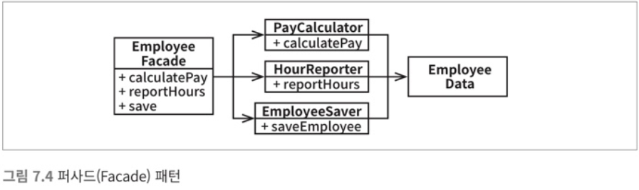

*[설계 원칙](설계%20원칙.md)*

*[설계 원칙](설계%20원칙.md)* 
| ***[Current Page]()*** 
| *[OCP >>](../08/8.%20개방-폐쇄%20원칙.md)*

---

# 7. SRP : 단일 책임 원칙

> 하나의 **모듈**은 하나의, 오직 하나의 **액터**에 대해서만 책임져야 한다.

- **모듈** : 소스파일 혹은 함수와 데이터로 구성되고 응집된 집합

- **액터** : 시스템이 동일한 방식으로 변경되기를 원하는 사용자나 이해관계자로 이루어진 집단

SRP 를 위반하는 징후를 보고 위의 말이 어떤 의미인지 이해해보자.

## 7.1 급여 애플리케이션

> 이 클래스는 SRP 를 위반한다. 세가지 메서드가 서로 다른 액터를 책임지기 때문.
 
 - `calculatePay()` 메서드는 **회계팀** 에서 기능을 정의. *CFO* 보고를 위해 사용
 - `reportHours()` 메서드는 **인사팀** 에서 기능을 정의. *COO* 보고를 위해 사용.
 - `save()` 메서드는 **DBA** 가 기능을 정의. *CTO* 보고를 위해 사용.

### 7.1.1 우발적 중복
 
 `calculatePay()` 메서드와 `reportHours()` 메서드는 사용하여 초과 근무를 제외한 
 업무 시간을 계산하는 알고리즘을 공유한다.
  개발자는 코드 중복을 피하기 위해 이 알고리즘을 `regularHours()`에 넣었고 각각의 
 메서드에서 이 메서드를 호출하여 사용한다.

 
> 1. *회계팀* 에서 초과 근무를 제외한 업무 시간 계산 알고리즘을 약간 수정하고자 한다.
> 2. 이 변경을 적용하는 개발자가 `calculatePay()` 메서드가 `regularHours()` 메서
>드를 호출한다는 사실을 발견하고 수정한다. **하지만** `reportHours()` 에도 호출된다는
> 사실은 눈치채지 못한다.
> 3. 변경사항 적용 후 테스트하고, *회계팀*은 동작을 검증한다.
> 4. 시스템은 배포되었고 *인사팀*(`reportHours()`를 사용하는)은 이 사실을 알지 못한다.
> 5. *인사팀*은 수정된 `reportHours()` 메서드가 생성한 엉터리 보고서를 여전히 이용한다.
> 6. 마침내 문제가 발견되고 *인사팀*은 격노한다. 잘못된 데이터로 수백만 달러의 예산이 
>지출되었기 때문이다.

### 해결 방법

>#### 서로 다른 액터가 의존하는 코드를 서로 분리하라

---

### 7.1.2 병합

 *DBA 가 속한 팀*에서 데이터베이스의 Employee 테이블 스키마를 약간 수정하기로 결정.
 이와 동시에 *인사팀* 에서 `reportHours()` 메서드의 보고서 포맷을 변경하기로 결정.
 두 개발자는 동시에 일을 처리.
 
 > 뛰어난 개발도구가 있지만 병합이 발생하는 모든 경우를 해결할 수는 없기에, 결과적으로
 > 병합 문제가 발생함

 ### 해결 방법
 
 #### 방법 1. 데이터와 메서드를 분리
 
 
 
 * 아무런 메서드가 없는 간단한 데이터구조 EmployeeData 클래스를 만든다.
 * 데이터를 세개의 클래스가 공유하도록 만든다.
 * 각 클래스는 자신의 메서드에 반드시 필요한 소스코드만을 포함한다.
 * 세 클래스는 서로의 존재를 몰라야 한다.
 
이렇게 처리하면 **우연한 중복** 문제는 피할 수 있다.

하지만 이 해결책은 개발자가 세 가지 클래스를 인스턴스화 하고 추적해야한다.

조금더 편한 방법이 있다. 
 
 #### 방법 2. 퍼사드 패턴
 

 * 데이터와 메서드를 클래스단위로 분리
 * 해당 클래스들을 포함하는 클래스 EmployeeFacade 를 생성
 * 세 클래스의 객체를 가지고있으며 요청된 메서드 기능을 해당 객체로 위임하는 일을 책임짐
