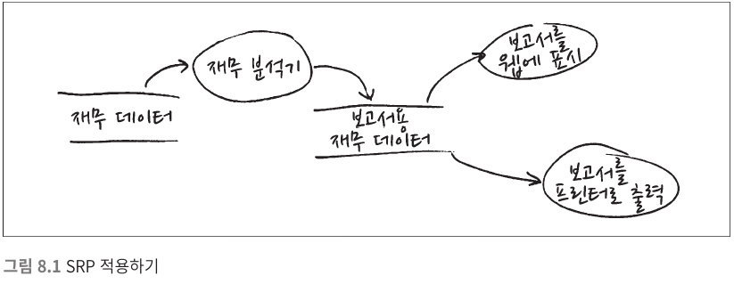
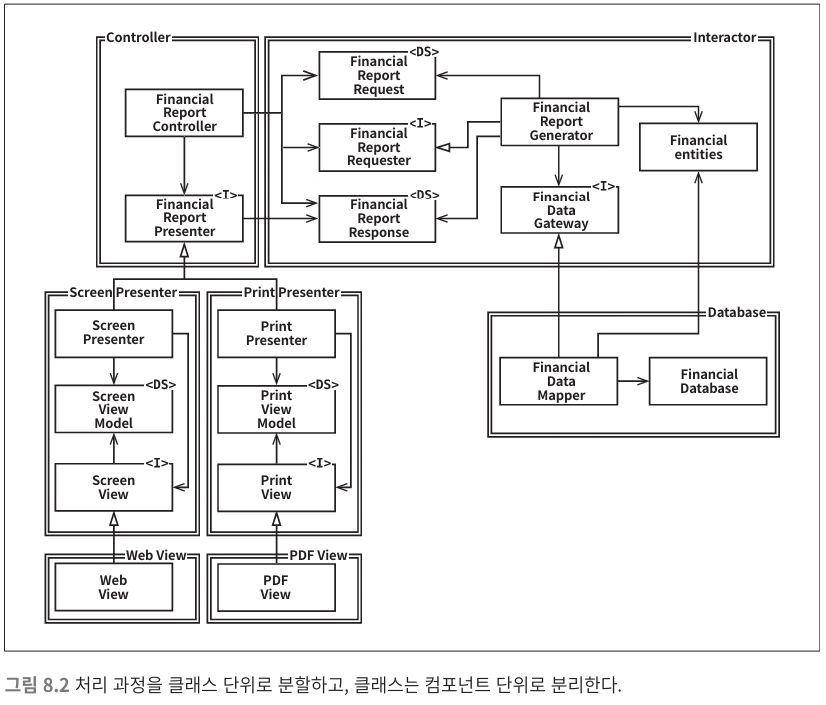
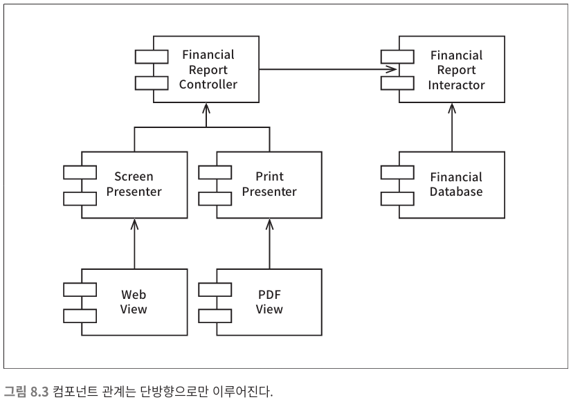

*[설계 원칙](../07/설계%20원칙)*

*[<< SRP](../08/8.%20개방-폐쇄%20원칙.md)* 
| ***[Current Page]()*** 
| *[LSP >>](../09/9.%20리스코프%20치환%20원칙.md)*

----

# 2. OCP : 개방- 폐쇄 원칙

> 소프트웨어 개체는 **확장** 에는 열려 있어야
> 하고, **변경**에는 닫혀있어야 한다.

## 사고실험

*재무재표를 웹 페이지로 보여주는 시스템이 있을 때, 이해관계자가 
해당 웹 페이지를 보고서 형태로 변환 -> 출력하는 기능을 만들라고
 지시했다.*

[단일 책임 원칙(SRP)](../07/7.%20단일%20책임%20원칙.md) 을 적용하여
데이터 흐름을 다음과 같은 형태로 만들었다.
               
                  

 보고서 생성이 두개의책임으로 분리되었다.
  
 * **소스코드의 의존성 조직화** 두 책임 중 하나에서 변경이 발생하더라도 다른 하나에 영향을 주어서는 안됨.
 * **확장을 열어둬야 함** 조직화 한 구조에서 새로운 확장이 일어날 때 변경이 일어나지 않음을 보장해야함.
 
 ### 위의 내용을 적용하여 만들어진 클래스 구조
 


 * **`I`**로 표시된 클래스는 *인터페이스*
 * **`DS`**로 표시된 클래스는 *데이터 구조*
 * 하얀색 화살표는 `사용(using)` 관계
 * 검은색 화살표는 `구현(implement)` 혹은 `상속(inheritance)` 관계
 
 > ### 모든 *의존성*이 **소스코드 의존성**을 나타냄 
 >`FinancialDataMapper` 는 `FinancialDataGateway` 를 알고있지만 
 >`FinancialDataGateway` 는 `FinancialDataMapper` 를 알지 못한다.

그림을 잘 보면 모든 화살표는 단방향으로만 이루어져있다

모든 컴포넌트간의 관계가 단방향으로만 이루어진다는 뜻이다

이들 화살표는 변경으로부터 보호하려는 컴포넌트를 향하도록 그려진다

 >각각의 컴포넌트들은 기능의 추가가 있을 수 있는 부분에는 `인터페이스`를 사용하여
 >**확장**에는 열려있고, 동시에(기능을 추가할 때) 일어날 수 있는 **변경** 에는 닫혀있다

 만약 `인터페이스`를 사용하지 않는다면 `Controller`는 `FinancialEntities`에 대해 `추이종속성`을 가지게 된다.
 ```text
추이 종속성
클래스 A 가 클래스 B 에 의존하고
다시 클래스 B가 클래스 C 에 의존한다면
클래스 A 는 클래스 C 에 의존하게 된다.
```

---
#### +




화살표의 방향을 유심히 살펴보면, `Interactor` 를 보호하려는 의지가 강하게 보인다.
여기서 말하는 `Interactor` 는 [**VIPER 패턴**](8.1%20VIPER%20패턴.md)안에서의 의미와 크게 다르지 않아보인다.

