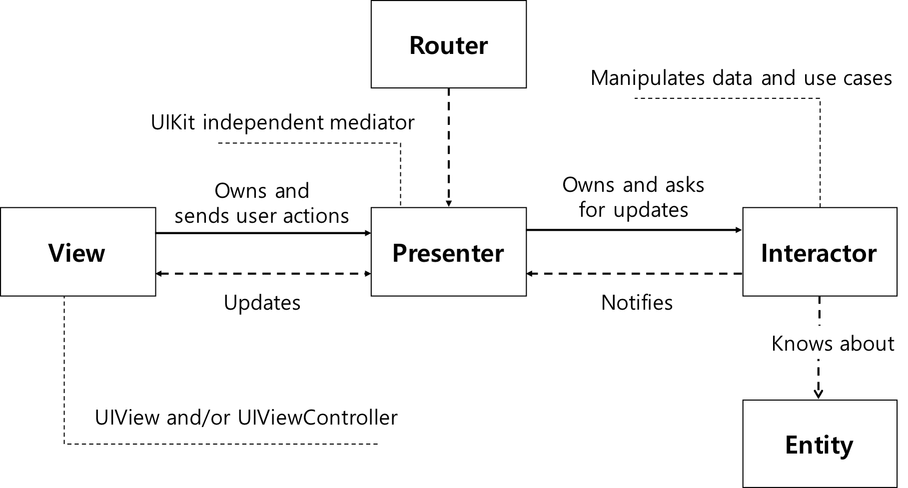

*[<< OCP 로 돌아가기](8.%20개방-폐쇄%20원칙.md)*
## VIPER 패턴

모바일 앱 에서 MVC 패턴을 대체하기 위해 나온 패턴이다.
간단하게 알아보고 위에서 보호하려는 `Interactor`가 왜 보호되어야 하는지 알아보자

> > ### `View`
> > `Persenter`의 요청대로 디스플레이를 만들고 사용자의 입력을 `Persenter` 로 보내는 작업을 한다  
> ---
> > ### `Interactor`
> > `Entity`모델 객체를 조작하는 로직을 담고있다
> > `View`, `Persenter`, `Router`, `Entity` 에서 발생한 어떠한 변경도 이 컴포넌트에 영향을 주어서는 안되며
> > 독립적으로 작동해야 한다
> ---
> > ### `Persenter`
> > `Interactor`로 부터 데이터를 가져오고, `View`로 보낼 데이터를 준비하여 ***언제*** `View`에 보여줄 지 결정한다
> ---
> > ### `Entity`
> > 모델 객체. 본문에서는 `Database`라고 쓰여지고있다
> ---
> > ### `Router`
> > 화면의 전환을 담당한다. `Presenter` 가 "언제" 화면을 전환해야 하는지 알고있다면,
> >  `Wireframe`는 화면전환을 "어떻게" 하는지를 알고있다.  
