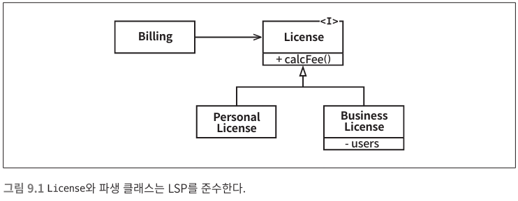
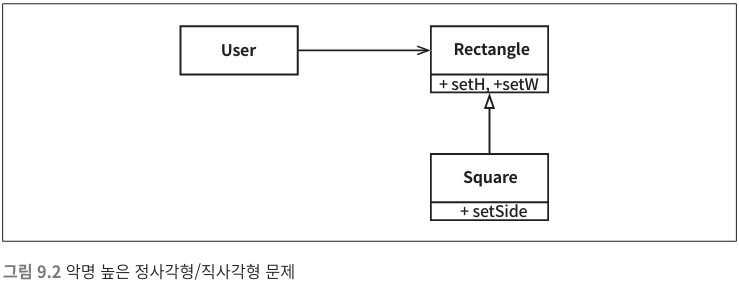

*[설계 원칙](../설계%20원칙)*

*[<< OCP](../08/8.%20개방-폐쇄%20원칙.md)* 
| ***[Current Page]()*** 
| *[ISP >>](../10/10.%20인터페이스%20분리%20원칙.md)*

----

# 3. LSP : 리스코프 치환 원칙

> 여기에서 필요한 것은 다음과 같은 `치환(substitution)` 원칙이다. S 타입의 객체 
o1 각각에 대응하는 T 타입 객체 o2가 있고, T 타입을 이용해서 정의한 모든 
프로그램 P에서 o2의 자리에 o1을 치환하더라도 P의 행위가 변하지 않는다 
면, S는 T의 하위 타입이다.

위 그림의 설계는 LSP 를 준수한다

`Billing` 애플리케이션의 행위가 `License` 하위 타입 중 무엇을 사용하는지에 전혀 의존하지 않기 때문이다

---

해당 설계는 LSP 를 위반한 사례 이다

`Rectangle` 의 **하위 타입**으로 `Square` 는 적합하지 않다

 * `Rectangle`은 높이와 너비가 독립적으로 변경 가능. 하지만 `Square`는 높이와 너비가 반드시 함께 변경됨.
 * `User`애플리케이션에서 `Square`를 사용하려 할 때, 혼동이 생길 수 있음.
 
위 설계를 유지하며 LSP 위반을 막는 유일한 방법은 `Rectangle`이 실제로는 `Square`인지를 검사하는
 메커니즘을 `User`에 추가하는것. 하지만 이렇게하면 `User` 의 행위가 사용하는 타입에 의존하게되며
 결국 타입을 서로 치환할 수 없게 된다.
 