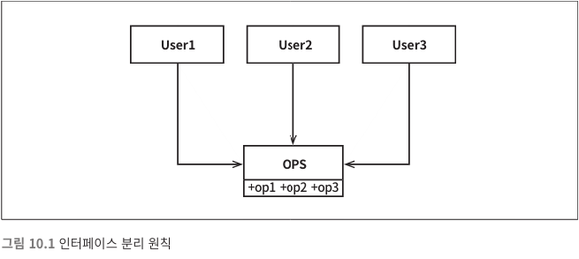
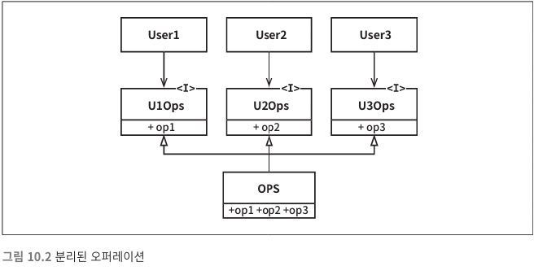

*[설계 원칙](../설계%20원칙)*

*[<< LSP](../09/9.%20리스코프%20치환%20원칙.md)* 
| ***[Current Page]()*** 
| *[DIP >>](../11/11.%20의존성%20역전%20원칙.md)*

----

# 10. ISP : 인터페이스 분리 원칙

 위 상황은 다수의 사용자가 OPS 클래스의 오퍼레이션을 사용한다
 
 이때, 각각의 사용자가 숫자에 맞는 기능들만 사용한다고 생각해보자
 
 > `User1` use `OPS.op1`

 > `User2` use `OPS.op2`

 > `User3` use `OPS.op3`

 정적 타입 언어로 작성된 클래스일때, `User1`은 `op2`와 `op3`를 전혀 사용하지 않더라도 
 `User1` 소스코드는 이 두 메서드에 의존하게 된다
 
 따라서 `op2`가 변경되면 `User1`도 다시 컴파일한 후 새로 배포해야 하는것이다.
 
 구조를 바꿔서 `ISP` 를 적용한 다이어그램을 보자
 
 ---
 
 
 
 위에서 바뀐것은 중간에 `인터페이스`가 추가된 것 뿐이다
  
 `User1`의 소스코드는 `U1Ops`와 `op1` 에는 의존하지만 `OPS`에는 의존하지 않게 된다.
  따라서 `OPS` 에서 발생한 변경이 `User1`과는 전혀 관계가 없다면 `User1` 을 다시 컴파일하고
  배포하는 상황은 초래되지 않는다
  
 ---
 
 ## ISP 와 언어
 
 > `ISP`는 언어 종류에 따라 영향받는 정도가 다르다.

정적 언어는 사용자가 `import`, `use` 또는 `include` 와 같은 타입 선언문을 사용하도록 강제한다

이처럼 소스코드에 `included(포함된)` 선언문으로 인해 소스 코드 의존성이 발생한다.

하지만 루비나 파이썬 같은 동적 타입 언어에서는 소스코드에 이러한 선언문이 존재하지 않는다

 대신 런타임에 추론이 발생한다. 따라서 소스코드의 의존성이 아예 없으며, 결국 재컴파일과 재배포가 필요 없다.
