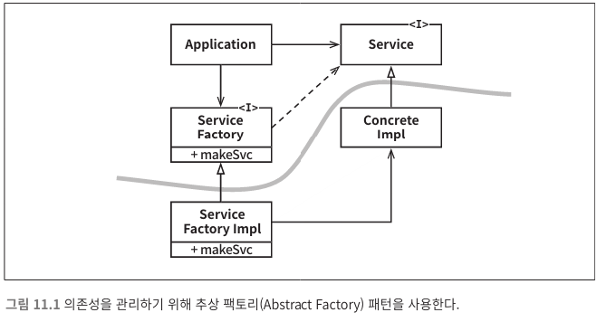

*[설계 원칙](../07/설계%20원칙.md)*

*[<< ISP](../10/10.%20인터페이스%20분리%20원칙.md)* 
| ***[Current Page]()*** 

----

# 11. DIP : 의존성 역전 원칙

 > 유연성이 극대화된 시스템을 만들기 위한 규칙.
> 소스코드 의존성이 `추상(abstraction)`에 의존하며 `구체(concretion)`에는 의존하지 않는다.
> 단, 이는 `변동성이 큰(volatile)` 구체적 요소 이며 안정성이 보장된 환경은 무시한다. *`예 : 자바의 String`* 

### 안정된 추상화

 안정된 소프트웨어 아키텍처를 설계하기 위해서 주의해야 할 점
 
> #### 변동성이 큰 구체 클래스를 참조하지 말라
> ```text
> 대신 추상 인터페이스를 참조하라
> ```
---

> #### 변동성이 큰 구체 클래스로부터 파생하지 말라
> ```text
> 정적 타입 언어에서 상속은 변경하기 어렵다. 
> 따라서 아주 신중하게 사용해야 한다.
> ```
---
 
> #### 구체 함수를 오버라이드 하지 말라
> ```text
> 대체로 구체 함수는 소스 코드의 의존성을 필요로 한다.
> 따라서 구체 함수를 오버라이드 하면 이러한 의존성을 제거할 수 없게되며,
> 실제로는 그 의존성을 상속하게 된다. 
> ```
---

> #### 구체적이며 변동성이 크다면 절대로 그 이름을 언급하지 말라
> ```text
> 사실 이 실 천법은 DIP 원칙을 다른 방식으로 풀어쓴 것이다.
> ```
---

### 팩토리

 사실상 모든 언어에서 객체를 생성하려면 해당 객체를 구체적으로 정의한 코드에 
 대해 소스코드 의존성이 발생하기 때문이다.
 
 ```java
 // Application source code
 Service conCreateService = new ConcreateImpl();
 conCreateService.create("test");
```
 
 `Application` 은 `Service` 인터페이스를 통해 `ConcreateImpl` 을 사용하지만, 
 `Application` 은 어떤식으로든 `ConcreateImpl`의 인스턴스를 생성해야 한다.
 
 이런 문제를 해결하기 위해 `추상 팩토리` 패턴을 사용하곤 한다.



 위는 추상 팩토리의 구조이다
 
 `Application` 에서는 더이상 `ConcreateImpl`인스턴스를 생성할 필요가 없어졌다
 
 > * `Application` 은 이제 `ServiceFactory` 인터페이스의 `makeSvc` 메서드를 호출한다.
 > ```text
 > 해당 변경으로 인해 더이상 Application 의 소스코드에는 ConcreateImpl 에 대한 의존성은 존재하지 않는다.
 >   ```
 > * `makeSvc` 메서드는 `ServiceFactory` 로부터 파생된 `ServiceFactoryImpl`에서 구현된다. 그리고 
 >  `ServiceFactoryImpl` 구현체가 `ConcreteImpl`의 인스턴스를 생성한 후 `Service` 
 >  타입으로 반환한다.
 > ```java
 >  // 의존성을 역전시켰다. 위의 코드를 변경된 구조로 바꿔보자
 >  Service conCreateService = ServiceFactory.makeSvc("test");
 >  conCreateService.create("test");
 > ```
 
---

 다시 그림을 잘 보자.


 가운데 곡선은 아키텍처 경계를 뜻한다. `구체적인 것들로 부터 추상적인 것들을 분리`
 
 소스코드 의존성은 해당 곡선과 교차할 때 모두 한 방향, 즉 추상적인 쪽으로 향한다.
 
 * 추상 컴포넌트는 애플리케이션의 모든 고수준 업무 규칙을 포함한다.
 * 구체 컴포넌트는 업무 규칙을 다루기 위해 필요한 모든 세부사항을 포함한다.
 
 제어의 흐름과 소스코드의 의존성이 서로 반대 방향으로 엇갈리고 있다.
 이것을 보고 의존성 역전 이라고 부른다.
 
---

### 구체 컴포넌트

 하지만 위 그림에서도 `DIP`위배가 완전히 사라진것은 아니다.
 
 > `ServiceFactoryImpl` 구체 클래스가 `ConcreteImpl` 구체 클래스에 의존한다.
  
  이는 일반적인 일이다.
 `DIP`위배를 모두 없앨 수는 없다.
 
 하지만 `DIP`를 위배하는 클래스들은 적은 수의 구체 컴포넌트 내부로 모을 수 있고, 
 이를 통해 시스템의 나머지 부분과는 분리할 수 있다.
 
