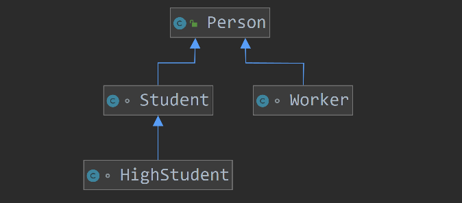

# 1.6 와일드 카드 타입

> #### 사용
> 
> ```java
> 제네릭타입<?>
> 제네릭타입<? extends 상위타입>
> 제네릭타입<? super 하위타입>
> ```

 * 코드에서 ?을 일반적으로 와일드카드`wildcard`라고 부름
 * 제네릭 타입을 매개값이나 리턴 타입으로 사용할 때 구체적인 타입 대신에 와일드카드를 사용할 수 있음
   1. `제네릭타입<?>` : 제한 없음
      - 타입 파라미터를 디치하는 구체적인 타입으로 모든 클래스나 인터페이스 타입이 올 수 있다.
   2. `제네릭타입<? extends 상위타입>` : 상위 클래스 제한
      - 타입 파라미터를 대치하는 구체적 타입으로 상위 타입이나 하위 타입만 올 수 있다.
   3. `제네릭타입<? super 하위타입>` : 하위 클래스 제한
        - 타입 파라미터를 대치하는 구체적인 타입으로 하위 타입이나 상위 타입이 올 수 있다.



Course.java

```java
public class Course<T> {
    private String name;
    private T[] students;

   public Course(String name, int capacity) {

        this.name = name;
        // 타입 파라미터로 배열을 생성할 수는 없다
        // Object 배열을 생성 후 T[] 로 캐스팅 해주어야 한다
        this.students = (T[])(new Object[capacity]);
   }

    public String getName() { return name; }
    public T[] getStudents() { return students; }

    // 배열에 비어있는 부분을 찾아서 수강생을 추가하는 메서드
    public void add(T t){
        for (int i = 0; i < students.length; i++) {
            if(students[i] == null){
                students[i] = t;
                break;
            }
        }
    }
}
```

Person.java

```java
public class Person {
    private String name;

    public Person(String name) {
        this.name = name;
    }

}

class Worker extends Person {
    public Worker(String name) {
        super(name);
    }
}

class Student extends Person { ... }      // Worker 클래스와 같음
class HighStudent extends Student { ... } // Worker 클래스와 같음
```

Main.java

```java
public static void registerCourse(Course<?> course){
    System.out.println(course.getName() + " 수강생: "+ Arrays.toString(course.getStudents()));
}

public static void registerCourseStudent(Course<? extends Student> course){
    System.out.println(course.getName() + " 수강생: "+ Arrays.toString(course.getStudents()));
}

public static void registerCourseWorker(Course<? super Worker> course){
    System.out.println(course.getName() + " 수강생: "+ Arrays.toString(course.getStudents()));
}

public static void main(String[] args) {
    Course<Person> personCourse = new Course<>("일반인 과정", 5);
    // 최상위 타입이기 때문에 모든 하위타입을 사용할 수 있음
    personCourse.add(new Person("일반인"));
    personCourse.add(new Worker("직장인"));
    personCourse.add(new Student("학생"));
    personCourse.add(new HighStudent("고등학생"));

    Course<Worker> workerCourse = new Course<>("직장인 과정", 5);
    // Worker 의 하위타입이 없음. 따라서 Worker 타입만 사용 가능
    workerCourse.add(new Worker("직장인"));

    Course<Student> studentCourse = new Course<>("학생 과정", 5);
    // Student 타입은 HighStudent 라는 하위타입이 존재함. 따라서 두개의 타입을 사용할 수 있음
    studentCourse.add(new Student("학생"));
    studentCourse.add(new HighStudent("고등학생"));
    // Error. 해당 타입으로는 접근할 수 없음.
//  studentCourse.add(new Worker("고등학생"));

    // HighStudent 타입 역시 하위타입이 없음. 따라서 자신의 타입만(HighStudent) 사용 가능
    Course<HighStudent> highStudentCourse = new Course<>("고등학생 과정", 5);
    highStudentCourse.add(new HighStudent("고등학생"));
}
```